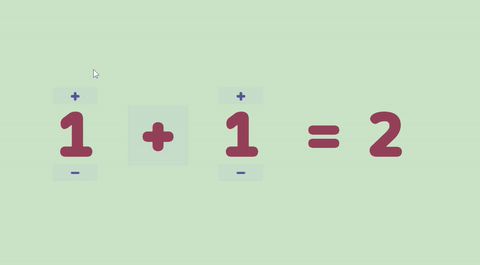

# unity_calc
My first Unity 2D project, a simple calculator 🎮

## Font
This project uses the [Maple Mono font](https://github.com/subframe7536/Maple-font)

## Play
Try it directly on Unity Play: [calc game](https://play.unity.com/en/games/b4a09b0f-ce85-4d86-816d-2a2a14639dde/calc)

## Additional
This is a learning-oriented project.
Enjoy.